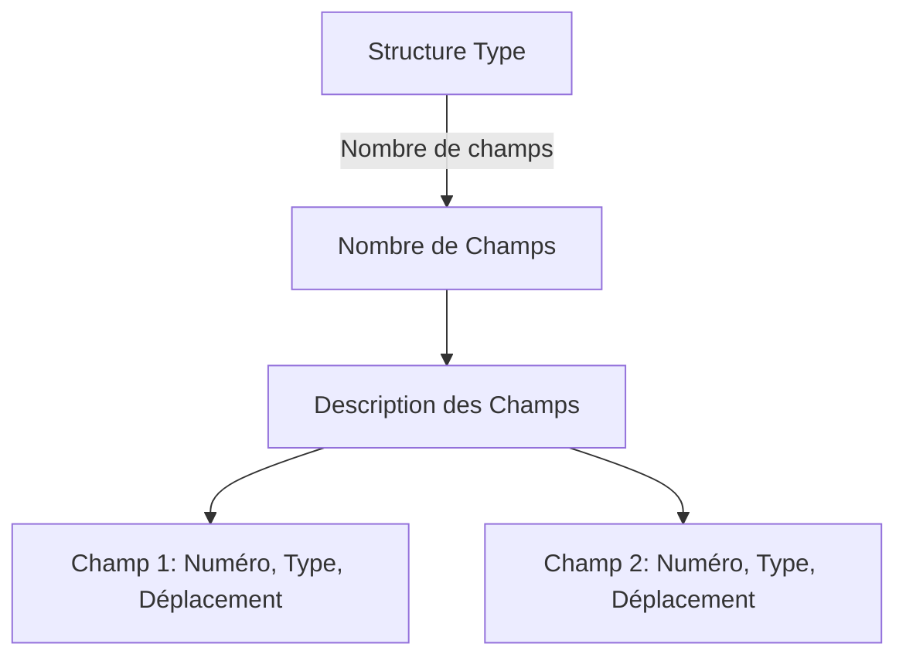
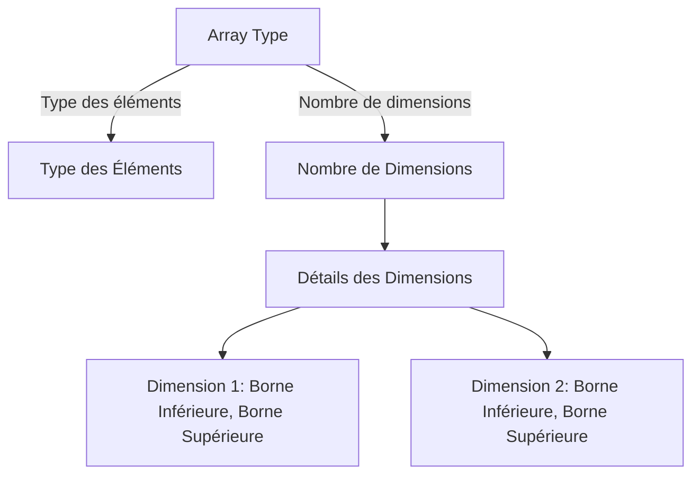
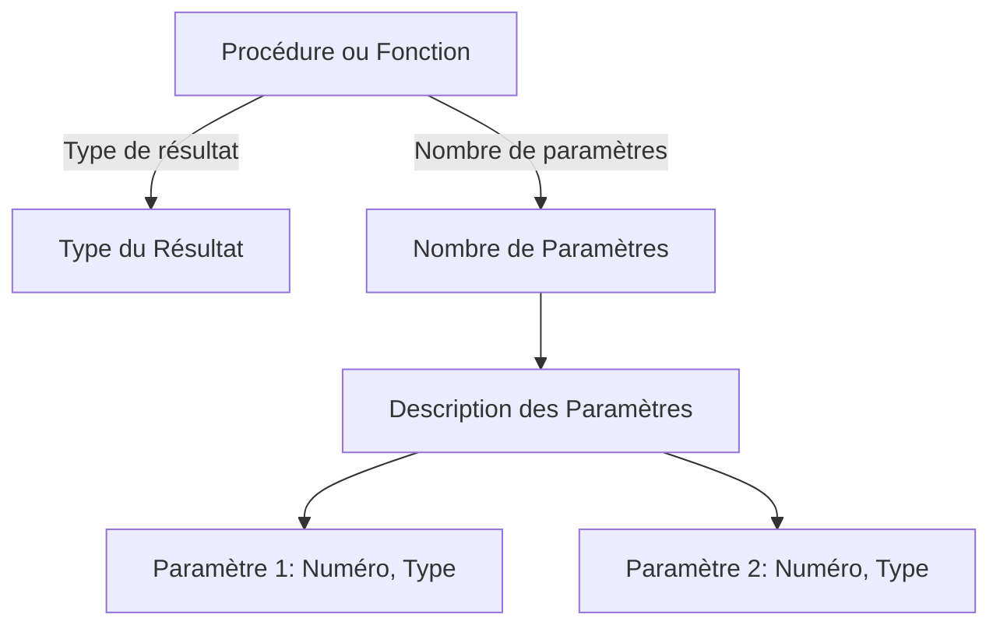

# CPYRR Compiler Project

This project is a compiler for the CPYRR programming language, which is a simple language designed for educational purposes. The compiler is implemented in C and uses the YACC parser generator to parse the language grammar. The compiler generates an abstract syntax tree (AST) from the parsed program and interprets the AST using a virtual machine.

## Notes

- The project is still under development and is not yet complete.
- The project is structured into different components, each handling a specific part of the compilation process.
- The project uses a Makefile to build the project and run the compiler.
- The next steps and tasks for the project are outlined in the [TODO.md](TODO.md) file.

## Folder Structure

```bash
/compiler
│
├── /src
│   ├── /ast
│   │   ├── ast.c                      # Abstract syntax tree (AST) creation and manipulation
│   │   ├── ast.h                      # Header file for AST data structures and functions
│   │   ├── lcrs.c                     # Left-Child Right-Sibling (LCRS) tree implementation
│   │   ├── lcrs.h                     # Header file for LCRS tree functions
│   │   ├── node_type.h                # Header file for defining AST node types
│   │
│   ├── /bin
│   │   ├── lex.yy.c                   # Generated lexical analyzer (by flex)
│   │   ├── y.tab.c                    # Generated parser (by yacc)
│   │   ├── y.tab.h                    # Header file for parser definitions
│   │
│   ├── /data
│   │   ├── region_stack.c             # Region stack management
│   │   ├── region_stack.h             # Header file for region stack functions
│   │   ├── region_table.c             # Region table implementation (region size, nesting, AST pointers)
│   │   ├── region_table.h             # Header file for region table definitions
│   │
│   ├── /lexer
│   │   ├── lexeme_table.c             # Lexicographical table (lexeme storage, hash table implementation)
│   │   ├── lexeme_table.h             # Header file for lexeme table definitions
│   │   ├── lexer.l                    # Lexical analysis (token generation and lexeme identification)
│   │
│   ├── /parser
│   │   ├── yacc_parser.y              # YACC grammar file
│   │   ├── parser.c                   # Parser implementation (calls lexing functions and constructs AST)
│   │   ├── parser.h                   # Header file for parser declarations
│   │
│   ├── /symbol_table
│   │   ├── declaration_table.c        # Declaration table implementation (for types, variables, functions)
│   │   ├── declaration_table.h        # Header file for declaration table definitions
│   │   ├── hash_table.c               # Hashing utility for lexeme table
│   │   ├── hash_table.h               # Header file for hashing functions
│   │   ├── representation_table.c     # Type representation table (structures, arrays, functions)
│   │   ├── representation_table.h     # Header file for type table
│   │
│   ├── /table_management
│   │   ├── array_manager.c            # Array-specific management utilities
│   │   ├── array_manager.h            # Header file for array utilities
│   │   ├── func_proc_manager.c        # Function and procedure utilities
│   │   ├── func_proc_manager.h        # Header file for function and procedure utilities
│   │   ├── structure_manager.c        # Structure-specific utilities
│   │   ├── structure_manager.h        # Header file for structure utilities
│   │   ├── variable_manager.c         # Variable-specific utilities
│   │   ├── variable_manager.h         # Header file for variable utilities
│   │
│   ├── /utils
│   │   ├── errors.c                   # Error handling utilities
│   │   ├── errors.h                   # Header file for error handling
│   │   ├── scope_tracker.c            # Scope tracking utilities
│   │   ├── scope_tracker.h            # Header file for scope tracking
│   │   ├── stack.c                    # Stack utilities
│   │   ├── stack.h                    # Header file for stack functions
│   │   ├── utils.h                    # General utility macros and functions
│   │
│   ├── /semantic_checks               # Semantic analysis and validation phase
│   │   ├── /function_checks
│   │   │   ├── function_validation.c  # Function-specific semantic validation
│   │   │   ├── function_validation.h  # Header file for function validation
│   │   ├── /scope_checks
│   │   │   ├── scope_validation.c     # Scope-related semantic validation
│   │   │   ├── scope_validation.h     # Header file for scope validation
│   │   ├── /type_checks
│   │   │   ├── type_validation.c      # Type-specific semantic validation
│   │   │   ├── type_validation.h      # Header file for type validation
│   │   ├── /variable_checks
│   │   │   ├── variable_validation.c  # Variable-specific semantic validation
│   │   │   ├── variable_validation.h  # Header file for variable validation
│   │   ├── validation_utils.h         # Common utilities for semantic checks
│   │   ├── semantic_checks.h          # Aggregator header for semantic checks
│   │
│   └── main.c                         # Main entry point for the compiler
│
├── Makefile                           # Main Makefile to build the project
├── README.md                          # Project documentation
└── intermediate_files/                # Folder to store intermediate representation files for later interpretation
```

## Key Components

1. **`/lexer`**: This directory contains code for lexical analysis and lexeme management using a hash table.
2. **`/parser`**: This holds the YACC grammar file and parser implementation.
3. **`/ast`**: Implements the abstract syntax tree (AST) to represent the parsed program structure.
4. **`/symbol_table`**: Symbol table is used to store information about the identifiers (symbols).
5. **`/virtual_machine`**: Implements the virtual machine, which interprets the AST and manages the stack.
6. **`/data`**: Contains the region table for tracking program regions and their associated data.
7. **`/utils`**: Utility functions such as hashing and error handling.
8. **`/output`**: Handles saving the intermediate code/text needed for future interpretation.
9. **`/test`**: Unit tests for each major component of the project to ensure proper functionality.


Here's a visual representation of the information, combining tables and hierarchical structures for better clarity. You can copy this Markdown and render it to visualize it as required.


# Table de représentation des types et des entêtes de sous-programmes

Cette table contient la description des types, des procédures et des fonctions déclarés dans un programme.

---

## Types de Structures

| **Attribut**                  | **Description**                                                                 |
|-------------------------------|---------------------------------------------------------------------------------|
| **Nombre de champs**           | Nombre total de champs dans la structure.                                      |
| **Champs**                    | Description des champs de la structure.                                        |
| **Numéro lexicographique**    | Identifiant unique pour chaque champ.                                          |
| **Type**                      | Index dans la table des déclarations associé à ce type ou une valeur de base.  |
| **Déplacement d'exécution**   | Emplacement relatif dans la structure (vide dans certaines phases).            |

### Exemple :


---

## Types de Tableaux

| **Attribut**             | **Description**                                                           |
|--------------------------|---------------------------------------------------------------------------|
| **Type des éléments**     | Index dans la table des déclarations associé à ce type.                  |
| **Nombre de dimensions**  | Total des dimensions du tableau.                                         |
| **Borne inférieure**      | Valeur minimale pour chaque dimension.                                   |
| **Borne supérieure**      | Valeur maximale pour chaque dimension.                                   |

### Exemple :


---

## Fonctions et Procédures

| **Attribut**             | **Description**                                                      |
|--------------------------|----------------------------------------------------------------------|
| **Type de résultat**      | Valeur (0, 1, 2 ou 3) indiquant le type (uniquement pour fonctions). |
| **Nombre de paramètres**  | Total des paramètres requis.                                        |
| **Paramètres**            | Description détaillée des paramètres.                              |
| **Numéro lexicographique**| Identifiant unique pour chaque paramètre.                          |
| **Type**                 | Valeur (0, 1, 2 ou 3) précisant le type du paramètre.               |

### Exemple :

