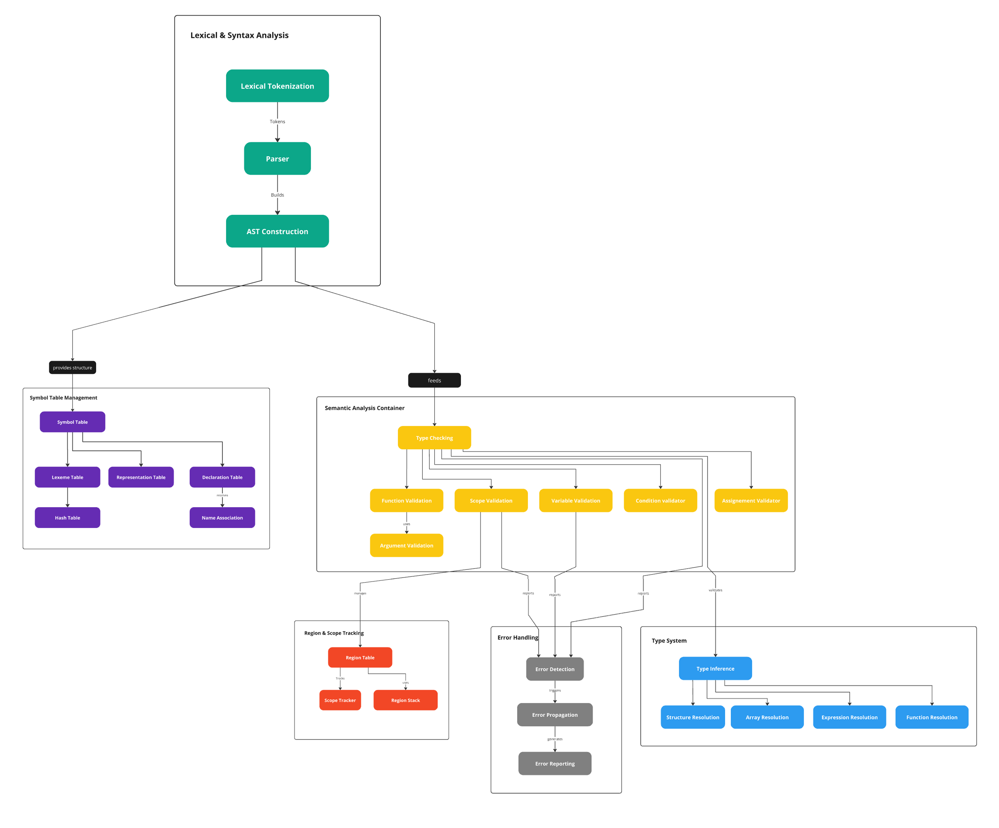
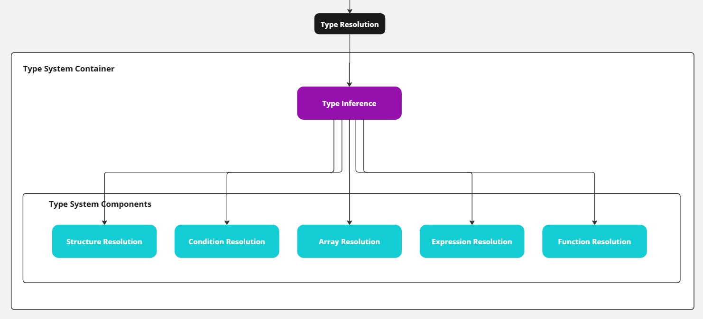
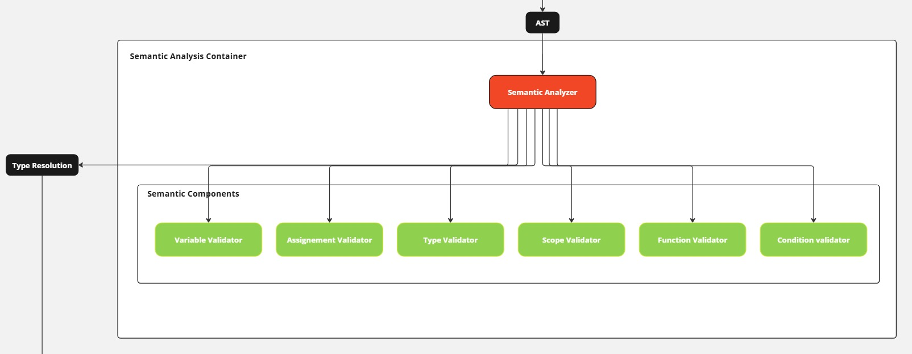

# Semantic Analysis in the Argonaut Compiler

Semantic analysis is a pivotal phase in the compiler's process, focusing on verifying the meaning of the program and ensuring that it adheres to the language's rules and constraints. This stage follows lexical and syntax analysis and precedes the generation of the intermediate representation. It involves checking for semantic errors that cannot be detected during earlier phases, such as type compatibility, variable scoping, and function signatures.

[toc]

## Overview

Semantic analysis ensures that the program is semantically correct and that all entities (variables, functions, types) are used appropriately. It relies heavily on the Symbol Table and the AST (Abstract Syntax Tree).

<figure>
    
    <figcaption>Figure 1: Overview of the Semantic Analysis in the Argonaut Compiler</figcaption>
</figure>

To ensure type validity for the Argonaut code, we need to introduce another module called ``type inference``, which helps determine the types of various elements during the semantic analysis phase. For example, when checking the assignment of a value to a variable, we need to determine both the type of the value and the type of the variable it is assigned to. This will be facilitated by the ``type inference`` module, which provides functions to retrieve the types of these elements efficiently.

So the main components our semantic analysis relies on is :

- The `symbol_table`: module that store all the information relative to the symbols found in the source file,
- The `data`: module that integrate the region table to store data relative to the scopes of the source code,
- The `ast`: that store the overall structure of the programm,
- The `type_system`: module that contain the ``type_inference`` module that provide helpful functions to resolve the type of a variable, returned type of a function, expression, type of the field of a structure ect...

## Type Inference

The type inference module consists of five submodules: 

<figure>
    
    <figcaption>Figure 2: Type Inference Components</figcaption>
</figure>

Additionally, there is a header file, `type_inference.h`, that contains the function declarations.

Here is an example of a function implemented inside the `type_inference` module:

```c
int resolve_func_proc_return_type(Node *function_call) {
    int nature = get_declaration_nature(function_call->index_declaration);

    if (nature == TYPE_FUNC) {
        int index_declaration = function_call->index_declaration;
        int index_representation = get_declaration_description(index_declaration);
        return get_representation_value(index_representation);
    }

    return NULL_VALUE;
}
```

This function returns the type of the value returned by a function call. A procedure does not return anything, so it must be handled separately. By taking a function call node from the AST, we can determine whether the call corresponds to a function or a procedure. If it is a function, we retrieve the type of the returned value stored in the representation table.

Check the `src/type_system/type_inference.h` file for more details on each defined function used for type resolution.

## Semantic Analysis Components

The semantic analysis is performed by the `semantic_analysis` module, which consists of several submodules, each responsible for performing a specific semantic check.

<figure>
    
    <figcaption>Figure 3: Semantic Analysis Components</figcaption>
</figure>

These components ensure that the program follows all semantic rules defined by the Argonaut language, guaranteeing that constructs such as type checking, scope validation, and function calls are correctly handled.

### Detailed Semantic Checks

#### Variable Validation

The compiler checks that all variables are declared before they are used. This involves looking up the variable in the **Declaration Table** to ensure it exists and is within the correct scope. An error is raised, if the variable is not found.

```c
void check_variable_definition(int index_lexeme_lexicographic) {
    if (find_declaration_index(index_lexeme_lexicographic) == NULL_VALUE) {
        set_error_type(&error, SEMANTIC_ERROR);
        set_error_message(&error, "Variable '%s' is not defined.", get_lexeme(index_lexeme_lexicographic));
        yerror(error);
    }
}
```

Another check is performed to ensure that a variable is not redefined in the same scope. This is done by looking up the variable in the **Declaration Table** and checking if it is within the same scope. If it is, an error is also raised.

```c
void check_variable_redefinition(int index_lexeme_lexicographic) {
    int index_lexeme_declaration = find_declaration_index_by_nature(index_lexeme_lexicographic, TYPE_VAR);
    if (index_lexeme_declaration != NULL_VALUE) {
        set_error_type(&error, SEMANTIC_ERROR);
        set_error_message(&error, 
            "Redefinition of variable '%s' at %s.\n"
            "  This variable has already been defined in the current scope.\n"
            "  Consider renaming or modifying the existing definition.\n",
            get_lexeme(index_lexeme_lexicographic),
            get_formatted_location()
        );
        
        int declaration_region = get_declaration_region(index_lexeme_declaration);
        int current_region = get_current_region_id();

        declaration_region == current_region ? yerror(error) : yywarn(error);
    }
}
```

#### Type Validation

Here the types we are talking about are the custom types defined in the Argonaut code, meaning that it is all the types that are defined by the user in the source code by using the keyword ``type``.

```js
type matrix : array[0:5, 0:5] of int;
type date : struct {
    day : int;
    month : int;
    year : int;
} fstruct;
```

In this case, the type ``matrix`` is a custom type defined by the user. It is a two-dimensional array of integers. The type ``date`` is a structure with three fields: ``day``, ``month``, and ``year``. Both ``date`` and ``matrix`` are defined in the same scope.
The compiler ensures that the types used in the program are properly defined.

```c
void check_type_definition(int index_type_lexicographic) {
    if (get_arr_struct_declaration_index(index_type_lexicographic) == NULL_VALUE) {
        // RAISE ERROR
    }
}
```

As for the variable definition, we also need to check if the type has been defined before or not :

```c
void check_type_redefinition(int index_lexeme_lexicographic, Nature nature) {
    int index_lexeme_declaration = get_arr_struct_declaration_index(index_lexeme_lexicographic);
    
    if (index_lexeme_declaration != NULL_VALUE && peek_region() == get_declaration_region(index_lexeme_declaration)) {
        // SET ERROR MESSAGE

        int declaration_region = get_declaration_region(index_lexeme_declaration);
        int current_region = get_current_region_id();

        declaration_region == current_region ? yerror(error) : yywarn(error);
    }
}
```

#### Condition Validation

To check the condition, we need to check if the condition is valid or not. For a condition to be valid, it must be of boolean type. Thanks to the ``type_system`` module, we can resolve the type of a boolean expression by calling the ``resolve_condition_type()`` function with the ast node of the condition as an argument.

```c
void check_condition(Node *condition) {
    // Step 1: Resolve the type of the condition
    int condition_type = resolve_condition_type(condition);

    // Step 2: Check if the condition is a valid boolean expression
    if (condition_type != A_BOOLEAN_LITERAL) {
        set_error_type(&error, TYPE_ERROR);
        set_error_message(&error, 
            "Invalid condition at %s.\n"
            "  Expected a boolean expression, but received '%s'.\n"
            "  Ensure the expression evaluates to a boolean value.\n",
            get_formatted_location(),
            (condition_type == NULL_VALUE) ? "UNKNOWN" : get_lexeme(condition_type)
        );
        yerror(error);
        return;
    }
}
```

If the condition is not a boolean expression, an error is raised.

#### Assignment Validation

There is three cases for the assignment:

- **Variable Assignment**: The assignment involves a variable and a value.
- **Array Assignment**: The assignment involves an array and a value.
- **Struct Assignment**: The assignment involves a structure and a value.

In each case, the assignment involves a variable and a value that can be an expression involving a function call, a literal, a variable, or arithmetic expression ect..

So for each identified case, we need to:

1. resolve the type of the variable,
2. resolve the type of the right-hand side of the assignment,
3. check if the types are compatible.

Here is the code for the variable assignment:

```c
void check_variable_assignment(int index_lexeme_lexicographic, Node *expression) {
    // Step 1: Retrieve the declaration index and type of the variable
    int index_lexeme_declaration = get_var_param_declaration_index(index_lexeme_lexicographic);
    int variable_type = get_declaration_description(index_lexeme_declaration);
    int variable_type_lexeme_index = get_declaration_lexicographic_index(variable_type);

    // Step 2: Resolve the type of the expression
    int expression_type = resolve_expression_type(expression);

    // Step 3: Check type compatibility
    if (variable_type != expression_type) {
        // RAISE ERROR
        return;
    }
}
```

This is the easiest case as a variable type can easily be inferred from the **declaration table**.
For the array assignment, we need to find the type of the array, however an array can be defined with a custom type, for example :

```js
type date : struct {
    day : int;
    month : int;
    year : int;
} fstruct;

type dates : array[0, 10] of date;
```

In this case, we need to resolve the type of the array, which is `date`, and then resolve the type the field that is being assigned to :

```js
var list_of_dates : dates;
list_of_dates[0].year  := 2023;
```

The type of the array is `date`, and the type of the field `year` is `int`. A similar complexity can be found for resolving a structure field type. So both validation are similar :

```c
void check_array_assignment(Node *array, Node *expression) {
    // Step 1: Resolve the type of the array
    int array_type = resolve_array_access_type(array);

    // Step 2: Resolve the type of the expression
    int expression_type = resolve_expression_type(expression);

    // Step 3: Check type compatibility
    if (array_type != expression_type) {
        // RAISE ERROR
        yerror(error);
        return;
    }
}
```

The resolution of the types of the array, the expression, and the type of the structure field is done in the ``type_inference`` module.

```c
void check_struct_assignment(Node *structure, Node *expression) {
    // Step 1: Resolve the type of the structure field access
    int struct_field_type = resolve_struct_field_access_type(structure);

    // Step 2: Resolve the type of the expression
    int expression_type = resolve_expression_type(expression);

    // Step 3: Check type compatibility
    if (struct_field_type != expression_type) {
        // RAISE ERROR
        yerror(error);
        return;
    }
}
```

### More Validations

Many more validations are done during the semantic phase, all the code relating to semantic analysis is in the ``semantic_analysis`` module and Argonaut code examples on semantic error are in the ``example/compilation/errors/semantic/`` directory.

## Example: Semantic Analysis in Action

Consider the following code snippet:

```js
var x : int;

func my_func(a: int) -> int {
    return 42 + a;
}

x := my_func(5);
```

The assignment `x := my_func();` involves several semantic checks:

1. **Variable Declaration Check**: Ensure that `x` is declared before being used.
2. **Function Declaration Check**: Ensure that `my_func` is declared before being called.
3. **Function Parameter Check**: Ensure that `my_func` is called with the correct number and type of parameters.
4. **Type Compatibility Check**: Ensure that the return type of `my_func` is compatible with the type of `x`.
5. **Variable Assignment Check**: Ensure that `x` is assigned a value of the correct type.
