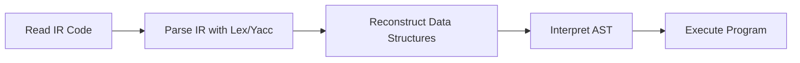

# The Argonaut Virtual Machine

## Introduction

The **Argonaut Virtual Machine (VM)** is a crucial component of the Argonaut language ecosystem. Designed for educational purposes, the VM executes programs written in Argonaut by reading the Intermediate Representation (IR) code generated by the Argonaut compiler. It parses the IR code, reconstructs the necessary data structures, and interprets the program according to the language's semantics.

This document provides an overview of the Argonaut VM, outlining its purpose, architecture, and main functionalities. Detailed explanations of specific components and concepts are available in the accompanying documents.

---

## Table of Contents

- [The Argonaut Virtual Machine](#the-argonaut-virtual-machine)
  - [Introduction](#introduction)
  - [Table of Contents](#table-of-contents)
  - [Overview of the Argonaut VM](#overview-of-the-argonaut-vm)
    - [Purpose and Functionality](#purpose-and-functionality)
    - [Workflow](#workflow)
  - [VM Architecture](#vm-architecture)
    - [Key Components](#key-components)
      - [Parser](#parser)
      - [Interpreter](#interpreter)
      - [Execution Environment](#execution-environment)
  - [Execution Process](#execution-process)
    - [Reading and Parsing the IR Code](#reading-and-parsing-the-ir-code)
    - [Interpreting the Program](#interpreting-the-program)

---

## Overview of the Argonaut VM

### Purpose and Functionality

The Argonaut VM serves as the execution engine for Argonaut programs. Its primary responsibilities include:

- **Reading the IR Code**: The VM reads the Intermediate Representation generated by the Argonaut compiler, which consists of symbol tables and the Abstract Syntax Tree (AST).

- **Parsing and Reconstructing Data Structures**: Using parsing tools, the VM reconstructs the necessary data structures from the IR code, such as the lexeme table, declaration table, representation table, and region table.

- **Interpreting the Program**: The VM interprets the reconstructed AST, executing the program according to the semantics of the Argonaut language.

### Workflow

The overall workflow of the Argonaut VM can be visualized as follows:

---

## VM Architecture

### Key Components

#### Parser

- **Function**: Reads the IR code and parses it to reconstruct the compiler's internal data structures.
- **Tools Used**: Utilizes **Lex** and **Yacc** for lexical analysis and parsing.
- **Output**: Reconstructed symbol tables and AST, ready for interpretation.

#### Interpreter

- **Function**: Traverses the AST and executes the program by interpreting each node according to its type.
- **Capabilities**:
  - Handles variable declarations and assignments.
  - Executes control flow statements (if-else, loops).
  - Manages function and procedure calls.
  - Maintains an execution stack and environment.

#### Execution Environment

- **Stack Frames**: Manages the call stack for function and procedure calls, including variable scopes.
- **Memory Management**: Allocates and deallocates memory for variables and data structures during execution.

---

## Execution Process

### Reading and Parsing the IR Code

The VM begins by reading the IR code generated by the compiler. This code includes:

- **Lexeme Table**: Contains all the lexemes (identifiers, literals) used in the program.
- **Declaration Table**: Holds information about declarations (variables, functions, types).
- **Representation Table**: Stores representations of complex types like arrays and structures.
- **Region Table**: Manages scopes and regions within the program.
- **AST**: Represents the syntactic structure of the program.

**Parsing Process**:

- The VM uses Lex and Yacc to define grammar rules for the IR code.
- As the IR code is parsed, the VM reconstructs the original data structures used during compilation.
- These structures are essential for the interpreter to correctly execute the program.

### Interpreting the Program

Once the data structures are reconstructed, the VM proceeds to interpret the program:

- **AST Traversal**: The interpreter recursively traverses the AST.
- **Node Execution**: Each node in the AST is executed based on its type:
  - **Declarations**: Variables and functions are registered in the execution environment.
  - **Expressions**: Evaluated to produce values.
  - **Statements**: Executed to perform actions (e.g., assignments, function calls).
- **Control Flow Management**: The interpreter handles control flow constructs, such as loops and conditional statements.
- **Function Calls**: Manages function invocation, parameter passing, and return values.
