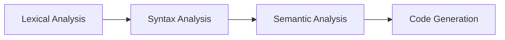
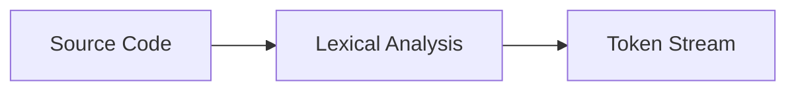
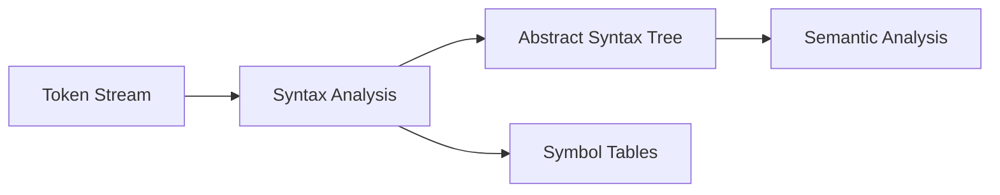
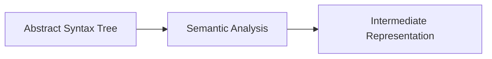

# The Argonaut Compiler

The **Argonaut Compiler** is responsible for translating source code written in the Argonaut language into an intermediate form that can be executed on the Argonaut Virtual Machine. The compilation process involves several distinct stages that ensure the code is syntactically correct, semantically valid, and ready for execution. Below is an overview of these stages.

## Compilation Stages



The diagram above illustrates the flow of the Argonaut compiler. Each stage of the compilation process plays a critical role in ensuring that the source code is correctly transformed into an intermediate form. The process starts with lexical analysis, moves through syntax and semantic analysis, and concludes with the generation of intermediate code ready for execution on the Argonaut Virtual Machine.

## Lexical Analysis

The first stage of the compilation process is lexical analysis, which involves breaking the source code into tokens. These tokens represent the smallest units of the language, such as keywords, identifiers, literals, and operators. The lexical analyzer scans the source code character by character, identifying and categorizing each token based on predefined rules. The resulting token stream is then passed to the next stage for further processing.



For example, consider the following Argonaut code snippet:

```js
var x := 10;
```

The lexical analyzer would break this code into the following tokens:

- Keyword: `var`
- Identifier: `x`
- Operator: `:=`
- Literal: `10`

The resulting token stream would be:

```txt
var, x, :=, 10, ;
```

All of these tokens are defined inside the lexer file `src/lexer/lexer.l`.
Here is an example of a token definition:

```c
"var"                           { error.column += yyleng; return VARIABLE; }
"proc"                          { error.column += yyleng; return PROCEDURE; }
"func"                          { error.column += yyleng; return FUNCTION; }
```

This first step also involves storing the lexemes in the **Lexeme Table** for later reference during the compilation process. The **Lexeme Table** is a data structure that stores all the lexemes (identifiers, strings, etc.) found in the source code. It facilitates efficient lexeme insertion, retrieval, and collision handling.

For each lexeme found, our lexer insert it into the **Lexeme Table**. For example the identifiers are inserted thanks to our lexical rules:

```c
{letter}+({letter}|{number}|"_"|"-")* {
    yylval.lexicographic_index = insert_lexeme(yytext);
    error.column += yyleng;
    return IDENTIFIER;
}
```

> [!NOTE]\
> For more details on how lexemes are managed and stored, refer to the [Lexeme Table](https://github.com/El-Khey/compilateur/wiki/Symbol-Table#lexeme-table) documentation.

## Syntax Analysis

The next stage of the compilation process is syntax analysis, which involves parsing the token stream to ensure that it conforms to the grammar of the Argonaut language. In our case, **Bison** ([learn about bison](https://thiagoh.github.io/bison/)) is used to define the grammar of Argonaut.

We define the grammar rules in the `src/parser/grammar.y` file. Here is an example of a rule:

```ts
variable_declaration: VARIABLE IDENTIFIER TWO_POINTS type SEMICOLON { 
                        declaration_variable_start($2, $4);
                        $$ = construct_node(A_VARIABLE_DECLARATION, $2, find_declaration_index($4));
                    }
;
```

The rules defined in the grammar file specify the structure of valid Argonaut programs. The parser uses these rules to build an abstract syntax tree (AST) that represents the program's structure and fill the **Symbol Tables** with the necessary information.



During the Syntax Analysis phase, the parser constructs the AST by following the grammar rules and checks for syntax errors. But it also checks for semantic errors, such as type mismatches, undeclared variables, and other issues that cannot be detected during lexical analysis.

> [!NOTE]\
> For more details on how the AST is constructed, refer to the [Abstract Syntax Tree](https://github.com/El-Khey/compilateur/wiki/Abstract-Syntax-Tree) documentation.

### Semantic Analysis

The semantic analysis phase of the compilation process focuses on verifying the meaning of the program and ensuring that it adheres to the language's rules and constraints. This stage involves checking for semantic errors that cannot be detected during lexical or syntax analysis, such as type compatibility, variable scoping, and function signatures.



This is the last step before generating the intermediate representation of the program.

All the semantic checks are done in the `src/semantic_analysis/` folder.
Let's take an example of a semantic check:

```c
void check_variable_definition(int index_lexeme_lexicographic) {
    if (find_declaration_index(index_lexeme_lexicographic) == NULL_VALUE) {
        set_error_type(&error, SEMANTIC_ERROR);
        set_error_message(&error, "Variable '%s' is not defined.", get_lexeme(index_lexeme_lexicographic));

        yerror(error);
    }
}
```

This function checks if a variable is defined in the Symbol Tables. For that, it uses the `find_declaration_index` function that returns the index of the declaration in the Symbol Tables. If the function returns `NULL_VALUE`, it means that the variable is not defined, and an error is raised.

Some more complex semantic checks like type compatibility are also done in this phase.
Let's take another example of a semantic check:

```c
void check_variable_assignment(int index_lexeme_lexicographic, Node *expression) {
    // Step 1: Retrieve the declaration index and type of the variable
    int index_lexeme_declaration = find_declaration_index(index_lexeme_lexicographic);
    int variable_type = get_declaration_description(index_lexeme_declaration);

    // Step 2: Resolve the type of the expression
    int expression_type = resolve_expression_type(expression);

    // Step 3: Check type compatibility
    if (variable_type != expression_type) {
        // ! DISPLAY ERROR
        return;
    }
}
```

This function checks if the type of the variable is compatible with the type of the expression assigned to it. It retrieves the type of the variable and the type of the expression and compares them. If they are not compatible, an error is raised.

The interesting part here is how the type of the expression is resolved. This is done by using the `resolve_expression_type` function that recursively resolves the type of the expression by traversing the AST and exploring the types of the nodes.

This analysis make also use of our Symbol Tables to retrieve the type of the wanted expression.

Let's break down the semantic analysis involved the assignment of a variable:

```js
var x : int;

func my_func() -> int {
    return 42;
}

x := my_func();
```

The assignment `x := my_func();` involves several semantic checks:

1. **Variable Declaration Check**: Ensure that the variable `x` is declared before being used.
2. **Function Declaration Check**: Ensure that the function `my_func` is declared before being called.
3. **Function Parameter Check**: Ensure that the function `my_func` is called with the correct number and type of parameters.
4. **Type Compatibility Check**: Ensure that the return type of `my_func` is compatible with the type of `x`.
5. **Variable Assignment Check**: Ensure that the variable `x` is assigned a valid value.

The declaration of `x` and `my_func` is checked against the *Declaration Table* to verify their existence and type. Then the check of the type compatibility between the return type of `my_func` and the type of `x` is done by comparing the types. The type of the `x` variable is retrieved from the *Declaration Table*, as the type if a variable is a stored inside the *Description* column of the declaration.

For the function `my_func`, the return type is stored in the *Representation* table, so we need a little more work to retrieve it.

````c
int resolve_func_proc_return_type(Node *function_call) {
    int nature = get_declaration_nature(function_call->index_declaration);

    if (nature == TYPE_FUNC) {
        int index_declaration = function_call->index_declaration;
        int index_representation = get_declaration_description(index_declaration);
        return get_representation_value(index_representation);
    }

    return NULL_VALUE;
}
````

This function retrieves the return type of a function or a procedure by using the *Declaration Table* and the *Representation Table*. For the functions the *Description* column of the *Declaration Table* stores the index of the *Representation Table* that contains the return type of the function.

> [!NOTE]\
> For more details on how the semantic analysis is performed, refer to the [Semantic Analysis](https://github.com/zestones/argonaut/wiki/Semantic-Analysis) documentation.
