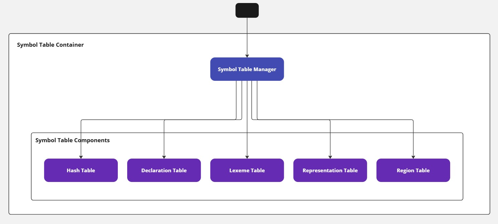

# Symbol Tables

The **Symbol Tables** are essential data structures used in the Argonaut compiler to store information about identifiers, such as variables, functions, and types, encountered during the compilation process. These tables facilitate efficient lookup, insertion, and management of symbols, ensuring correct scoping and type checking in the compiler.

<figure>
    
    <figcaption>Figure 1: Components of the Symbol Tables in the Argonaut Compiler</figcaption>
</figure>

## Lexeme Table

The **Lexeme Table** is a fundamental data structure used in the lexical analysis phase of the Argonaut compiler. It is responsible for storing all the lexemes (identifiers, strings, etc.) that are found in the source code. The structure of the lexeme table ensures efficient lexeme insertion, retrieval, and collision handling.

### Structure and Functionality

The **Lexeme Table** is implemented as an array of `Lexeme` structures. Each structure contains the following fields:

| **Index** | **Lexeme** | **Length** | **Next** |
|-----------|------------|------------|----------|
| The index         | The actual string representing the lexeme.      | The number of characters in the lexeme string.          |  An index pointing to the next lexeme in the chain, used to handle hash collisions.      |

The table operates with a **linked list** approach. When two lexemes hash to the same index, they are linked through the `next` pointer. This linked structure allows the table to efficiently manage multiple lexemes that share the same hash value.

### Hash Table

The **Hash Table** supports efficient lookups of lexemes by storing the hash values of lexemes and associating each hash with a lexicographic index in the **Lexeme Table**. The **Hash Table** is an array where each index stores the position of a lexeme within the **Lexeme Table**.

| **Hash** | **Lexicographic Index** |
|----------|-------------------------|
| The hash value of the lexeme         | The index of the last lexeme with this hash in the lexeme table.      |

Each lexeme's hash value is computed using a simple hash function that sums the ASCII values of the characters in the lexeme and then takes the modulo of the result with the hash table size.

### Lexeme Table and Hash Table Interaction

The **Lexeme Table** and the **Hash Table** work in tandem to efficiently store and access lexemes during the lexical analysis phase:

1. **Hash Calculation**: When a new lexeme is encountered, a hash value is calculated for it using a hash function. This hash value is used to find a corresponding index in the **Hash Table**.
2. **Insertion**:
   - If the hash index is empty, the lexeme is inserted into the **Lexeme Table** at that index.
   - If the hash index is already occupied (i.e., a collision occurs), the **Lexeme Table** uses the `next` pointer to link the new lexeme to the existing one, forming a chain of lexemes with the same hash value.
3. **Retrieval**: When searching for a lexeme:
   - The hash value is computed and used to look up the appropriate index in the **Hash Table**.
   - If the lexeme at that index matches the searched lexeme, it is returned.
   - If a collision exists (i.e., multiple lexemes share the same hash), the `next` pointer in the **Lexeme Table** is followed to check subsequent entries until the lexeme is found or the end of the chain is reached.

This dual-table approach, with a **Lexeme Table** for storing lexemes and a **Hash Table** for quick lookups, optimizes both memory usage and access time, ensuring that lexemes are efficiently handled even in the presence of hash collisions.

Here is a simple example of how the **Lexeme Table** and **Hash Table** work together:

Suppose we have the Argonaut source code snippet:

```js
var ab : int;
var ba : float;
```

We will have the following entries in the **Lexeme Table** and **Hash Table**:


### Link between Lexeme and Hash Table

- **Hash Table Index 3**: Points to `Lexeme Table Index 5` ("ba").
- **Hash Table Index 11**: Points to `Lexeme Table Index 0` ("int").
- **Hash Table Index 12**: Points to `Lexeme Table Index 2` ("bool").
- **Hash Table Index 22**: Points to `Lexeme Table Index 1` ("float").
- **Hash Table Index 30**: Points to `Lexeme Table Index 3` ("char").

In the case of a hash collision (such as `"ab"` and `"ba"`), the `next` pointer in the `lexeme_table` entry links colliding lexemes together.

For example, the lexeme `"ab"` is inserted at index 4 in the `lexeme_table`, and its `next` pointer refers to index 5, where `"ba"` is stored. The `hash_table` uses the lexeme's hash value to efficiently map it to the corresponding index, improving look-up speed for lexemes during the compilation process.

---

## Declaration Table

The **Declaration Table** is a critical component of the Argonaut compiler, responsible for storing and managing all declarations of types, variables, procedures, and functions encountered during the compilation process. It plays a crucial role in identifier resolution, type checking, and ensuring correct scoping.

### Structure and Functionality

The **Declaration Table** is divided into two main sections: a primary table and an overflow area. The primary table is indexed by the lexicographic numbers of identifiers, mirroring the structure of the **Lexeme Table**. Each entry in the table contains five fields, whose interpretation depends on the value of the `NATURE` field:

1. **NATURE**: Specifies the type of declaration:
   - `NATURE=1`: Structure type declaration.
   - `NATURE=2`: Array type declaration.
   - `NATURE=3`: Variable declaration.
   - `NATURE=4`: Parameter declaration.
   - `NATURE=5`: Procedure declaration.
   - `NATURE=6`: Function declaration.

2. **Next**: A link to other declarations with the same name in the overflow area. This field is used to handle collisions where multiple declarations share the same identifier.

3. **Region Number**: The region number containing the declaration. This helps in managing scopes and lifetimes of declarations.

4. **Type/Index**:
   - For structure or array types (`NATURE=1` or `NATURE=2`): An index in the type representation table, which contains detailed descriptions of complex types.
   - For variables or parameters (`NATURE=3` or `NATURE=4`): An index in the declaration table of the associated type declaration. Values 0-3 indicate base types (integer, real, boolean, character).
   - For procedures or functions (`NATURE=5` or `NATURE=6`): An index in the type representation table for the procedure/function header, detailing the function signature.

5. **Execution Info (exec)**:
   - For structure or array types: The size at execution, which is crucial for memory allocation.
   - For variables or parameters: The offset at execution, indicating the memory location relative to the base of the stack frame.
   - For procedures or functions: The region number associated with the procedure/function, aiding in stack management during execution.

### Overflow Area

The overflow area is used to handle collisions where multiple declarations share the same identifier. It stores additional entries that are chained from the primary table using the `Next` field. This ensures that all declarations are accessible, even when they share the same name.

---

## Type and Subprogram Header Representation Table

The **Type and Subprogram Header Representation Table** is a crucial component of the Argonaut compiler, responsible for storing detailed descriptions of complex types (structures and arrays) and the headers of procedures and functions declared in the program. This table is essential for type checking, memory management, and ensuring correct execution of the compiled code.

### Structure and Functionality

The table is an array of integers, where each entry represents a specific aspect of a type or subprogram header. The table is divided into sections for structures, arrays, and subprogram headers, each with its own set of descriptive fields.

#### For Structures

1. **Field Count**: The number of fields in the structure.
2. **For Each Field**:
   - **Lexicographic Number**: The lexicographic index of the field name.
   - **Type Index**: An index in the declaration table that points to the type declaration of the field. Values 0-3 indicate base types (integer, real, boolean, character).
   - **Execution Offset**: The offset at execution to access the field within the structure. This field is crucial for memory layout and access during runtime.

#### For Arrays

1. **Element Type**: An index in the declaration table that points to the type declaration of the array elements.
2. **Dimension Count**: The number of dimensions of the array.
3. **For Each Dimension**:
   - **Lower Bound**: The lower bound of the dimension.
   - **Upper Bound**: The upper bound of the dimension.

#### For Functions and Procedures

1. **Return Type (Functions Only)**: A value (0-3) indicating the return type of the function (integer, real, boolean, character). This field does not exist for procedures.
2. **Parameter Count**: The number of parameters the function or procedure accepts.
3. **For Each Parameter**:
   - **Lexicographic Number**: The lexicographic index of the parameter name.
   - **Type**: A value (0-3) indicating the base type of the parameter.

---

## Region Table

The **Region Table** is a crucial component of the Argonaut compiler, designed to manage the various regions within a program, such as the main program, functions, and procedures. Each region is associated with specific information that aids in memory management and execution control.

### Structure and Purpose

The **Region Table** is structured as an array of `Region` entries, each representing a block of code with a specific scope. Each entry contains three key fields:

1. **Data Size**: This field represents the memory space needed to store variables within the region. It is crucial for allocating and freeing memory during execution, ensuring that memory is managed correctly.

2. **Static Nesting Level (NIS)**: This field indicates how many regions enclose the current region. The main program has an NIS of 0, while nested functions and procedures have increasing NIS values. This helps manage variable scope and visibility, ensuring that variables are correctly accessed and deallocated.

3. **Pointer to the Abstract Syntax Tree (AST)**: This field provides access to the instructions within the corresponding block. The AST is used for various compilation and optimization tasks, providing a structured representation of the code.

### Key Functionalities

The **Region Table** supports several key functionalities essential for managing regions during compilation and execution:

- **Creating a Region**: Each new region is inserted into the **Region Table** with its nesting level and memory size. This is done using the `start_region` function, which also pushes the region's index onto a region stack.

```c
void start_region() {
    if (region_table_size >= MAX_REGION_COUNT) {
        fprintf(stderr, COLOR_RED "<Error> Region table is full\n" COLOR_RESET);
        exit(EXIT_FAILURE);
    }

    int nis = get_region_stack_size();
    int size = (region_table_size > 0) ? nis + 1 : 0;

    region_table[region_table_size] = construct_region(size, nis);
    push_region(region_table_size);

    region_table_size++;
}
```

- **Dynamic Region Management**: A region stack is used to track active regions during execution. When a region starts, its index is pushed onto the stack, and when it ends, it is popped from the stack using the `end_region` function.

```c
void end_region() {
    pop_region();
}
```

### Example

Consider a program where a function `f` is defined within the main program, and another function `g` is nested inside `f`. The **Region Table** might look like this:

| Index | Size | NIS | AST (Instructions)     |
|-------|------|-----|-----------------------|
| 0     | 50   | 0   | Main Program           |
| 1     | 20   | 1   | Function `f`           |
| 2     | 10   | 2   | Function `g`           |

In this example, `g` has an NIS of 2 because it is defined inside `f`, which itself has an NIS of 1. This structure helps the compiler manage memory and scope effectively.
