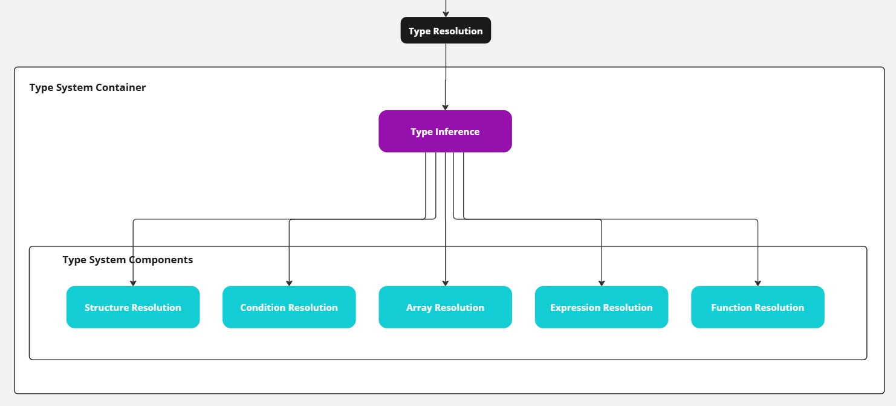
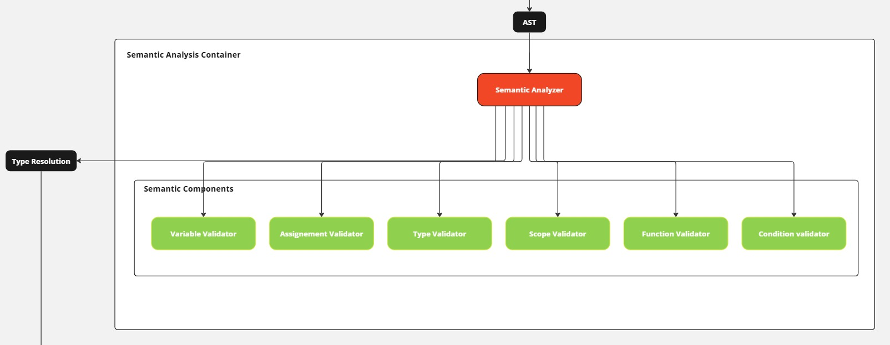

# Semantic Analysis in the Argonaut Compiler

## Introduction

Semantic analysis is a crucial phase in the compilation process, coming after lexical and syntax analysis and before code generation. In the Argonaut compiler, semantic analysis ensures that the source code is not only syntactically correct but also semantically meaningful according to the language's rules and type system. It verifies that all variables, functions, types, and expressions are used appropriately, adhering to the language's constraints.

This documentation provides an in-depth look at the semantic analysis performed by the Argonaut compiler, detailing its components, processes, and how it integrates with other modules like the symbol table, abstract syntax tree (AST), and type inference system.

---

## Table of Contents

- [Semantic Analysis in the Argonaut Compiler](#semantic-analysis-in-the-argonaut-compiler)
  - [Introduction](#introduction)
  - [Table of Contents](#table-of-contents)
  - [Overview](#overview)
  - [Components of the Semantic Analyzer](#components-of-the-semantic-analyzer)
    - [Symbol Tables](#symbol-tables)
    - [Abstract Syntax Tree (AST)](#abstract-syntax-tree-ast)
    - [Type System and Type Inference](#type-system-and-type-inference)
  - [Type Inference Module](#type-inference-module)
    - [Function Example](#function-example)
    - [Type Inference Functions](#type-inference-functions)
  - [Semantic Analysis Processes](#semantic-analysis-processes)
    - [Detailed Semantic Checks](#detailed-semantic-checks)
      - [Variable Validation](#variable-validation)
      - [Type Validation](#type-validation)
      - [Condition Validation](#condition-validation)
      - [Assignment Validation](#assignment-validation)
    - [More Validations](#more-validations)
  - [Example: Semantic Analysis in Action](#example-semantic-analysis-in-action)
  - [Conclusion](#conclusion)

---

## Overview

Semantic analysis in the Argonaut compiler serves to ensure that the program is semantically correct, meaning it makes sense according to the language rules and conventions. Unlike syntax analysis, which checks the structure of the code, semantic analysis checks the meaning. It verifies:

- **Type correctness**: Ensuring that operations are performed on compatible types.
- **Scope rules**: Variables and functions are used within their valid scopes.
- **Function calls**: Correct number and types of arguments are passed.
- **Variable usage**: Variables are declared before use and not redeclared in the same scope.

<figure>
    
    <figcaption>Figure 1: Semantic Analysis in the Compiler Pipeline</figcaption>
</figure>

---

## Components of the Semantic Analyzer

The semantic analyzer relies on several key components:

### Symbol Tables

The **Symbol Tables** are data structures that stores information about identifiers (variables, functions, types, etc.) in the program. It keeps track of:

- Identifier names
- Types
- Scopes and visibility
- Memory locations or offsets

### Abstract Syntax Tree (AST)

The **Abstract Syntax Tree (AST)** is a hierarchical tree representation of the source code structure. Each node represents a language construct (e.g., expressions, statements, declarations). During semantic analysis, the AST is traversed to check for semantic correctness.

### Type System and Type Inference

The **Type System** defines the rules for how types interact within the language. The **Type Inference** module assists in determining the types of expressions and ensuring type compatibility across operations.

---

## Type Inference Module

The `type_inference` module plays a crucial role in resolving the types of various elements during semantic analysis. It consists of several submodules that provide functions to retrieve and infer types for:

- Variables
- Functions and procedures
- Expressions
- Array elements
- Structure fields

<figure>
    
    <figcaption>Figure 2: Type Inference Components</figcaption>
</figure>

### Function Example

An example function implemented in the `type_inference` module is `resolve_func_proc_return_type`, which determines the return type of a function call:

```c
int resolve_func_proc_return_type(Node *function_call) {
    int nature = get_declaration_nature(function_call->index_declaration);

    if (nature == TYPE_FUNC) {
        int index_declaration = function_call->index_declaration;
        int index_representation = get_declaration_description(index_declaration);
        return get_representation_value(index_representation);
    }

    return NULL_VALUE; // Procedures do not return a value
}
```

This function:

1. Checks if the identifier corresponds to a function (not a procedure).
2. Retrieves the return type of the function from the declaration and representation tables.
3. Returns the inferred type for further semantic checks.

### Type Inference Functions

The `type_inference` module provides functions such as:

- `resolve_variable_type(Node *variable)`: Determines the type of a variable.
- `resolve_expression_type(Node *expression)`: Infers the type of an expression.
- `resolve_array_access_type(Node *array_access)`: Resolves the type of an array element.
- `resolve_struct_field_access_type(Node *struct_access)`: Resolves the type of a structure field.
- `resolve_condition_type(Node *condition)`: Determines if a condition evaluates to a boolean type.

These functions are essential for ensuring type correctness throughout the semantic analysis phase.

---

## Semantic Analysis Processes

Semantic analysis involves several processes to validate the program's correctness. Key semantic checks include variable validation, type validation, condition validation, assignment validation, etc.

<figure>
    
    <figcaption>Figure 3: Semantic Analysis Components</figcaption>
</figure>

### Detailed Semantic Checks

#### Variable Validation

The compiler checks that all variables are declared before they are used. This involves looking up the variable in the **Declaration Table** to ensure it exists and is within the correct scope. An error is raised, if the variable is not found.

```c
void check_variable_definition(int index_lexeme_lexicographic) {
    if (find_declaration_index(index_lexeme_lexicographic) == NULL_VALUE) {
        set_error_type(&error, SEMANTIC_ERROR);
        set_error_message(&error, "Variable '%s' is not defined.", get_lexeme(index_lexeme_lexicographic));
        yerror(error);
    }
}
```

Another check is performed to ensure that a variable is not redefined in the same scope. This is done by looking up the variable in the **Declaration Table** and checking if it is within the same scope. If it is, an error is also raised.

```c
void check_variable_redefinition(int index_lexeme_lexicographic) {
    int index_lexeme_declaration = find_declaration_index_by_nature(index_lexeme_lexicographic, TYPE_VAR);
    if (index_lexeme_declaration != NULL_VALUE) {
        set_error_type(&error, SEMANTIC_ERROR);
        set_error_message(&error, 
            "Redefinition of variable '%s' at %s.\n"
            "  This variable has already been defined in the current scope.\n"
            "  Consider renaming or modifying the existing definition.\n",
            get_lexeme(index_lexeme_lexicographic),
            get_formatted_location()
        );
        
        int declaration_region = get_declaration_region(index_lexeme_declaration);
        int current_region = get_current_region_id();

        declaration_region == current_region ? yerror(error) : yywarn(error);
    }
}
```

#### Type Validation

Here the types we are talking about are the custom types defined in the Argonaut code, meaning that it is all the types that are defined by the user in the source code by using the keyword ``type``.

```js
type matrix : array[0:5, 0:5] of int;
type date : struct {
    day : int;
    month : int;
    year : int;
} fstruct;
```

In this case, the type ``matrix`` is a custom type defined by the user. It is a two-dimensional array of integers. The type ``date`` is a structure with three fields: ``day``, ``month``, and ``year``. Both ``date`` and ``matrix`` are defined in the same scope.
The compiler ensures that the types used in the program are properly defined.

```c
void check_type_definition(int index_type_lexicographic) {
    if (get_arr_struct_declaration_index(index_type_lexicographic) == NULL_VALUE) {
        // RAISE ERROR
    }
}
```

As for the variable definition, we also need to check if the type has been defined before or not :

```c
void check_type_redefinition(int index_lexeme_lexicographic, Nature nature) {
    int index_lexeme_declaration = get_arr_struct_declaration_index(index_lexeme_lexicographic);
    
    if (index_lexeme_declaration != NULL_VALUE && peek_region() == get_declaration_region(index_lexeme_declaration)) {
        // SET ERROR MESSAGE

        int declaration_region = get_declaration_region(index_lexeme_declaration);
        int current_region = get_current_region_id();

        declaration_region == current_region ? yerror(error) : yywarn(error);
    }
}
```

#### Condition Validation

To check the condition, we need to check if the condition is valid or not. For a condition to be valid, it must be of boolean type. Thanks to the ``type_system`` module, we can resolve the type of a boolean expression by calling the ``resolve_condition_type()`` function with the ast node of the condition as an argument.

```c
void check_condition(Node *condition) {
    // Step 1: Resolve the type of the condition
    int condition_type = resolve_condition_type(condition);

    // Step 2: Check if the condition is a valid boolean expression
    if (condition_type != A_BOOLEAN_LITERAL) {
        set_error_type(&error, TYPE_ERROR);
        set_error_message(&error, 
            "Invalid condition at %s.\n"
            "  Expected a boolean expression, but received '%s'.\n"
            "  Ensure the expression evaluates to a boolean value.\n",
            get_formatted_location(),
            (condition_type == NULL_VALUE) ? "UNKNOWN" : get_lexeme(condition_type)
        );
        yerror(error);
        return;
    }
}
```

If the condition is not a boolean expression, an error is raised.

#### Assignment Validation

There is three cases for the assignment:

- **Variable Assignment**: The assignment involves a variable and a value.
- **Array Assignment**: The assignment involves an array and a value.
- **Struct Assignment**: The assignment involves a structure and a value.

In each case, the assignment involves a variable and a value that can be an expression involving a function call, a literal, a variable, or arithmetic expression ect..

So for each identified case, we need to:

1. resolve the type of the variable,
2. resolve the type of the right-hand side of the assignment,
3. check if the types are compatible.

Here is the code for the variable assignment:

```c
void check_variable_assignment(int index_lexeme_lexicographic, Node *expression) {
    // Step 1: Retrieve the declaration index and type of the variable
    int index_lexeme_declaration = get_var_param_declaration_index(index_lexeme_lexicographic);
    int variable_type = get_declaration_description(index_lexeme_declaration);
    int variable_type_lexeme_index = get_declaration_lexicographic_index(variable_type);

    // Step 2: Resolve the type of the expression
    int expression_type = resolve_expression_type(expression);

    // Step 3: Check type compatibility
    if (variable_type != expression_type) {
        // RAISE ERROR
        return;
    }
}
```

This is the easiest case as a variable type can easily be inferred from the **declaration table**.
For the array assignment, we need to find the type of the array, however an array can be defined with a custom type, for example :

```js
type date : struct {
    day : int;
    month : int;
    year : int;
} fstruct;

type dates : array[0, 10] of date;
```

In this case, we need to resolve the type of the array, which is `date`, and then resolve the type the field that is being assigned to :

```js
var list_of_dates : dates;
list_of_dates[0].year  := 2023;
```

The type of the array is `date`, and the type of the field `year` is `int`. A similar complexity can be found for resolving a structure field type. So both validation are similar :

```c
void check_array_assignment(Node *array, Node *expression) {
    // Step 1: Resolve the type of the array
    int array_type = resolve_array_access_type(array);

    // Step 2: Resolve the type of the expression
    int expression_type = resolve_expression_type(expression);

    // Step 3: Check type compatibility
    if (array_type != expression_type) {
        // RAISE ERROR
        yerror(error);
        return;
    }
}
```

The resolution of the types of the array, the expression, and the type of the structure field is done in the ``type_inference`` module.

```c
void check_struct_assignment(Node *structure, Node *expression) {
    // Step 1: Resolve the type of the structure field access
    int struct_field_type = resolve_struct_field_access_type(structure);

    // Step 2: Resolve the type of the expression
    int expression_type = resolve_expression_type(expression);

    // Step 3: Check type compatibility
    if (struct_field_type != expression_type) {
        // RAISE ERROR
        yerror(error);
        return;
    }
}
```

### More Validations

Many more validations are done during the semantic phase, all the code relating to semantic analysis is in the ``semantic_analysis`` module and Argonaut code examples on semantic error are in the ``example/compilation/errors/semantic/`` directory.

## Example: Semantic Analysis in Action

Consider the following Argonaut code snippet:

```argonaut
var x : int;

func my_func(a : int) -> int {
    return 42 + a;
}

x := my_func(5);
```

**Semantic Analysis Steps**:

1. **Variable Declaration Check**:
   - Ensure `x` is declared before use.
   - `x` is declared as `int`, so the check passes.

2. **Function Declaration Check**:
   - Ensure `my_func` is declared before being called.
   - `my_func` is properly declared, so the check passes.

3. **Function Parameter Check**:
   - Check that `my_func` is called with the correct number and type of arguments.
   - `my_func` expects an `int`; it is called with `5` (`int`), so the check passes.

4. **Return Type Verification**:
   - Ensure the expression `42 + a` in `my_func` returns an `int`.
   - Both `42` and `a` are integers; the addition results in an `int`, so the return type is valid.

5. **Type Compatibility Check**:
   - `x` is of type `int`.
   - `my_func(5)` returns an `int`.
   - The types are compatible, so the assignment `x := my_func(5);` is valid.

6. **Variable Assignment Check**:
   - Verify that `x` is assigned a value of the correct type (`int`).
   - The value being assigned is `int`, so the check passes.

**Result**: No semantic errors are detected, and the code is semantically correct.

---

## Conclusion

Semantic analysis is a vital phase in the Argonaut compiler, ensuring that code not only follows syntactical rules but also makes logical sense within the language's semantics. By thoroughly checking variable declarations, type usage, expression validity, and assignment compatibility, the compiler can catch a wide range of errors before code generation.

The integration of the **Symbol Table**, **AST**, and **Type Inference** modules allows the semantic analyzer to perform comprehensive checks efficiently. Understanding these components and their interactions is crucial for anyone looking to extend or debug the Argonaut compiler.

**Key Takeaways**:

- **Semantic Analysis Checks**:
  - Variable definitions and scopes.
  - Type definitions and usage.
  - Expression and condition validity.
  - Assignment type compatibility.
  - Function and procedure correctness.

- **Type Inference**:
  - Essential for resolving types in expressions.
  - Supports complex structures like arrays and structs.

- **Error Handling**:
  - Clear and informative error messages aid in debugging.
  - Early detection of issues prevents cascading errors in later stages.
