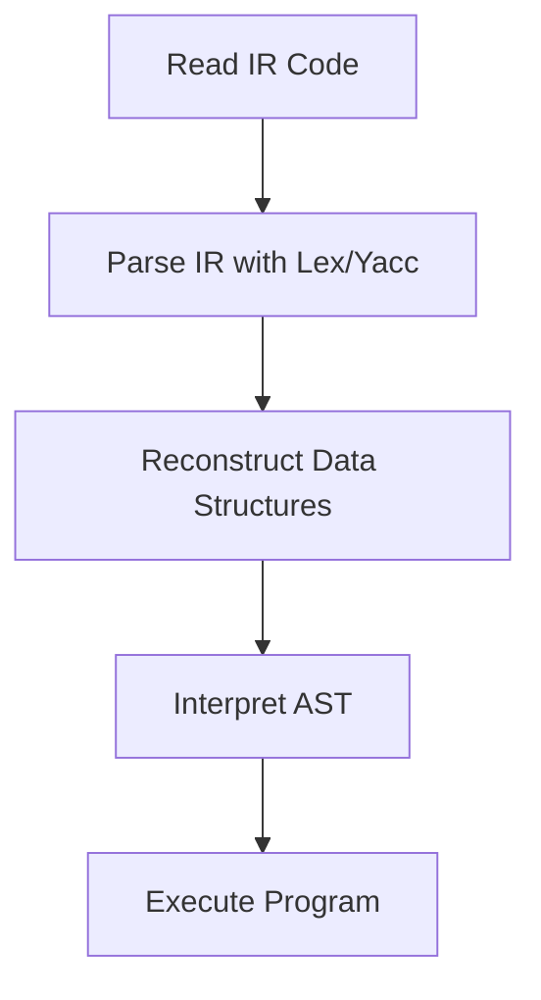

# Introduction to the Argonaut Virtual Machine

## Overview

The **Argonaut Virtual Machine (VM)** is a fundamental component of the Argonaut programming language ecosystem. Designed with educational purposes in mind, the VM serves as the execution engine that interprets and runs programs written in Argonaut. By processing the Intermediate Representation (IR) code generated by the Argonaut compiler, the VM bridges the gap between high-level language constructs and executable actions.

## Purpose

The primary objectives of the Argonaut VM include:

- **Educational Tool**: To provide learners with a clear and tangible understanding of how virtual machines operate, interpret code, and manage execution flow.
- **Understanding Compiler Concepts**: To demonstrate the practical application of compiler design principles, such as parsing, symbol table management, and AST traversal.
- **Simplified Execution**: To facilitate the execution of Argonaut programs without the complexities of optimization, focusing instead on the core mechanisms of interpretation and execution.

## Core Functionality

The Argonaut VM performs several key functions to execute Argonaut programs:

1. **Reading Intermediate Representation (IR) Code**: The VM begins by ingesting the IR code produced by the Argonaut compiler. This IR is a structured and detailed representation of the source code, encapsulating symbol tables and the Abstract Syntax Tree (AST).

2. **Parsing the IR Code**: Utilizing tools like **Lex** and **Yacc** (or their modern counterparts **Flex** and **Bison**), the VM parses the IR code to reconstruct vital data structures. These structures include:
   - **Lexeme Table**: Lists all tokens (identifiers, literals, keywords) used in the program.
   - **Declaration Table**: Contains information about variable, function, and type declarations.
   - **Representation Table**: Stores representations of complex types such as arrays and structures.
   - **Region Table**: Manages scopes and regions, essential for variable access and control flow.
   - **Abstract Syntax Tree (AST)**: Represents the hierarchical syntactic structure of the program.

3. **Reconstructing Data Structures**: As the IR code is parsed, the VM rebuilds the symbol tables and AST. This reconstruction is crucial for accurately interpreting the program's logic and execution flow.

4. **Interpreting the AST**: The VM traverses the AST, executing operations as defined by each node. This involves:
   - **Variable Management**: Handling declarations, assignments, and scope resolutions.
   - **Control Flow Execution**: Managing loops, conditionals, and branching statements.
   - **Function and Procedure Calls**: Managing call stacks, handling parameters, and retrieving return values.
   - **Memory Management**: Allocating and deallocating memory within stack frames during program execution.

## Workflow

The Argonaut VM operates through a sequential workflow that ensures accurate and efficient program execution. The high-level workflow is illustrated below:

1. **Read IR Code**: The VM loads the IR code generated by the compiler.
2. **Parse IR with Lex/Yacc**: Lexical analysis and parsing are performed to tokenize and understand the structure of the IR code.
3. **Reconstruct Data Structures**: Symbol tables and the AST are rebuilt from the parsed IR.
4. **Interpret AST**: The VM traverses the AST, executing commands and managing memory as defined by each node.
5. **Execute Program**: The program runs to completion, performing the intended computations and actions.

## Relationship with Other Components

The Argonaut VM operates in conjunction with other components of the Argonaut language system:

- **Argonaut Compiler**: Transforms high-level Argonaut source code into IR code, which the VM then executes.
- **Intermediate Representation (IR)**: Acts as the intermediary between the compiler and the VM, containing all necessary information for accurate program interpretation.
- **Symbol Tables and AST**: Essential data structures that the VM relies on to understand and execute the program's logic.

For a detailed view of the compilation stages and how the VM fits into the broader Argonaut ecosystem, refer to the [Argonaut Compiler](https://github.com/zestones/Argonaut/wiki/The-Argonaut-Compiler) documentation.

---

## Further Documentation

To gain a deeper understanding of specific aspects of the Argonaut VM, refer to the following detailed documents:

- [VM Architecture and Components](vm-architecture-and-components.md)
- [Stack Management](stack_management.md)
- [Stack Frames and the Call Stack](Stack_Frames_and_Call_Stack.md)
- [Static and Dynamic Links](Static_and_Dynamic_Links.md)
- [Address Computation and Memory Allocation](address_computation_and_memory_access)

Each document provides comprehensive insights into the respective topics, ensuring a thorough understanding of the Argonaut VM's inner workings.
