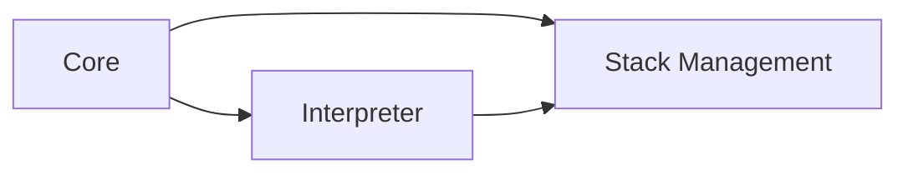
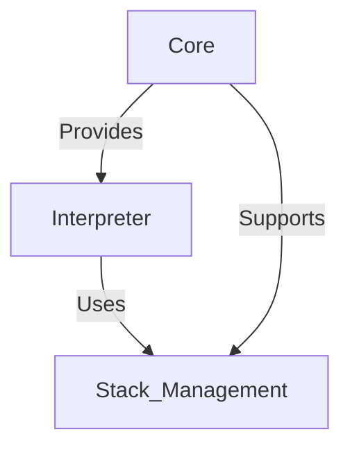

# VM Architecture and Components

## Introduction

The **Argonaut Virtual Machine (VM)** is designed to execute programs written in the Argonaut language by interpreting the Intermediate Representation (IR) generated by the Argonaut compiler. Understanding the architecture and components of the VM is essential for grasping how Argonaut programs are executed efficiently and correctly.

This document provides an overview of the VM's architecture, detailing its main components, their responsibilities, and how they interact to facilitate program execution. For deeper insights into specific areas, refer to the associated documentation:

- [Execution Environment and Memory Management](03-execution_environment_and_memory_management.md)
- [Stack Frames and the Call Stack](Stack_Frames_and_Call_Stack.md)
- [Static and Dynamic Links](Static_and_Dynamic_Links.md)
- [Function Call Mechanism](Function_Call_Mechanism.md)
- [Recursive Function Handling](Recursive_Function_Handling.md)
- [Address Computation and Memory Allocation](Address_Computation_and_Memory_Allocation.md)

## Architecture Overview

The Argonaut VM is structured into three primary modules, each responsible for distinct aspects of program execution:

1. **Core**
2. **Interpreter**
3. **Stack Management**

These modules work cohesively to parse IR code, manage memory and execution contexts, and interpret program logic.

### Core

The **Core** module serves as the backbone of the VM, providing fundamental functionalities that support both the interpreter and stack management. It includes components responsible for address computation, execution control, and handling VM cells.

**Subcomponents:**

- **Address Calculation (`address`)**: Manages the logic for computing memory addresses for variables, arrays, and structures.
- **Execution (`execution.c` & `execution.h`)**: Controls the flow of program execution, handling operations like assignments and updates.
- **VM Cell (`vm_cell.c` & `vm_cell.h`)**: Defines the structure for VM cells, which are the basic units of memory used to store variable values.

### Interpreter

The **Interpreter** module is responsible for executing the program by traversing the Abstract Syntax Tree (AST) and performing operations as defined by each node. It handles various aspects of program execution, including assignments, conditions, expressions, function and procedure calls, and loops.

**Subcomponents:**

- **Assignment (`assignement`)**: Manages variable assignments and updates in the VM.
- **Condition (`condition`)**: Handles conditional statements like `if-else` structures.
- **Expression (`expression`)**: Evaluates arithmetic and boolean expressions.
- **Function and Procedure (`func_proc`)**: Manages the invocation and execution of functions and procedures.
  - **Predefined Functions (`predefined`)**: Includes built-in functions such as `input` and `print`.
- **Loop (`loop`)**: Handles loop constructs like `for` and `while` loops.

### Stack Management

The **Stack Management** module oversees the creation, manipulation, and destruction of stack frames, which are essential for maintaining execution contexts during function and procedure calls. It ensures that each function call has its own environment, preserving variable states and handling return values.

**Subcomponents:**

- **Frame (`frame`)**: Defines the structure of a stack frame, including static and dynamic links, local variables, and return addresses.
- **Stack Management (`stack_management.c` & `stack_management.h`)**: Provides functionalities to push and pop stack frames, manage the call stack, and maintain the integrity of execution contexts.

## Component Interactions

Understanding how these modules interact is key to comprehending the VM's operation:

1. **Core and Interpreter**: The Core provides essential services like address calculation and execution control, which the Interpreter relies on to perform operations and manage program flow.
2. **Interpreter and Stack Management**: As the Interpreter executes functions and manages control flow, it utilizes the Stack Management module to handle stack frames, ensuring that each function call has a dedicated execution context.
3. **Core and Stack Management**: Core functionalities support Stack Management by providing mechanisms for memory access and updating VM cells within stack frames.

## Detailed Module Responsibilities

### Core Module

- **Address Calculation**: Computes memory addresses for variables, arrays, and structures based on the current execution context.
- **Execution Control**: Manages the flow of execution, handling operations such as assignments, updates, and interfacing with the execution stack.
- **VM Cell Management**: Defines and manages VM cells, which store values of different types (integer, float, boolean, etc.).

### Interpreter Module

- **Assignment Handling**: Executes assignment statements, updating variable values in the appropriate stack frames.
- **Condition Evaluation**: Evaluates conditions in `if-else` statements and directs the flow of execution accordingly.
- **Expression Evaluation**: Processes and computes values of arithmetic and boolean expressions.
- **Function and Procedure Execution**: Manages the invocation of functions and procedures, including parameter passing and return value handling.
- **Loop Execution**: Executes loop constructs by evaluating loop conditions and iterating through loop bodies.

### Stack Management Module

- **Frame Construction**: Creates new stack frames for each function or procedure call, setting up static and dynamic links.
- **Frame Destruction**: Removes stack frames upon function or procedure completion, restoring the previous execution context.
- **Call Stack Maintenance**: Maintains the call stack, ensuring proper order of execution and handling of nested or recursive function calls.
- **Return Value Handling**: Stores and retrieves function return values within stack frames, facilitating correct value passing between functions.
