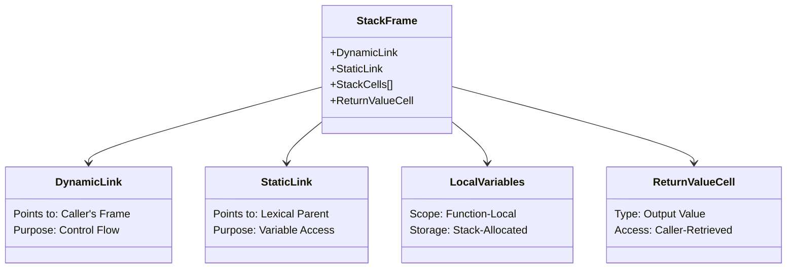
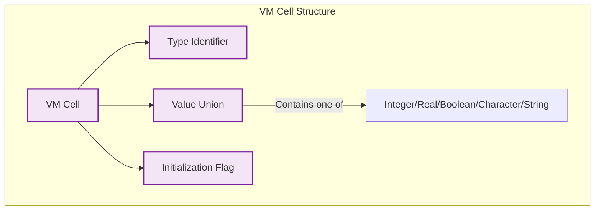
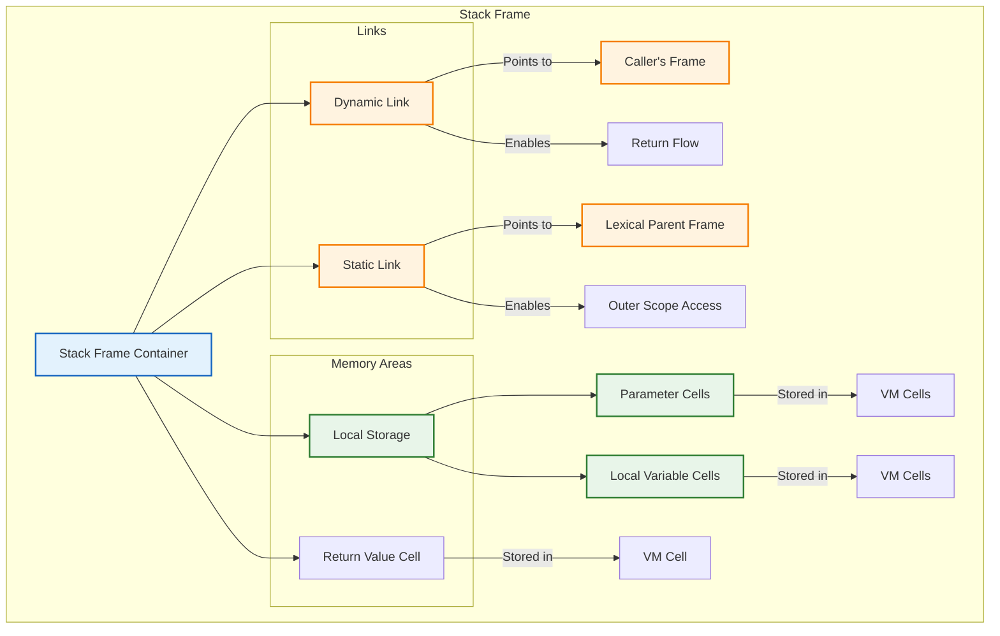

# Stack Management in the Argonaut Virtual Machine

## Introduction

The **Stack Management** module is a critical component of the Argonaut Virtual Machine (VM), responsible for managing stack frames during program execution. Stack frames are essential for maintaining the execution context of functions and procedures, allowing the VM to handle variable storage, function calls, and control flow effectively. This document provides an overview of the stack management mechanisms, including stack frame structure, memory allocation, and frame management.

## Table of Contents

- [Stack Management in the Argonaut Virtual Machine](#stack-management-in-the-argonaut-virtual-machine)
  - [Introduction](#introduction)
  - [Table of Contents](#table-of-contents)
  - [Purpose of Stack Management](#purpose-of-stack-management)
  - [Stack Frame Structure](#stack-frame-structure)
    - [What is a Cell ?](#what-is-a-cell-)
    - [Local Storage: The Function's Private Workspace](#local-storage-the-functions-private-workspace)
    - [Visualization of a Stack Frame](#visualization-of-a-stack-frame)
  - [Stack Management Functions](#stack-management-functions)
    - [Frame Creation and Initialization](#frame-creation-and-initialization)
    - [Pushing and Popping Frames](#pushing-and-popping-frames)
    - [Updating and Accessing Cells](#updating-and-accessing-cells)
  - [Continue Reading](#continue-reading)

---

## Purpose of Stack Management

The primary purpose of stack management in the Argonaut VM is to:

1. **Execution Context Preservation**
  Every function invocation creates a self-contained environment where local variables exist independently of other calls. This isolation enables recursive patterns - a function can call itself repeatedly, with each invocation maintaining its own distinct set of variables without interference from previous or subsequent calls.

2. **Call Stack Management**
   The system maintains a strict last-in-first-out (LIFO) order of function executions. When function *A* calls function *B*, *B*'s context is stacked on top of *A*'s. Upon *B*'s completion, the VM precisely unwinds the stack to resume *A*'s execution exactly where it paused, preserving the integrity of complex call hierarchies.

3. **Variable Lifecycle Control**
   Automatic memory management for local variables is achieved through strict stack discipline. Variables spring into existence when their containing function is called and are automatically cleaned up when the function returns, preventing memory leaks while eliminating manual memory management overhead.

4. **Lexical Scoping Implementation**
   Through its static link mechanism, the stack system creates a chain of visibility that allows inner functions to access variables from outer scopes while preventing outer functions from accessing inner scope variables. This implements the language's scoping rules at runtime.

---

## Stack Frame Structure

Each stack frame acts as a sealed container for a function's execution state. The structure can be visualized as having four distinct compartments:



### What is a Cell ?

A cell serves as the fundamental storage unit in the Argonaut VM, designed to hold a single typed value. The value stored can only be of base types (i.e. int, float, bool, char, string). Here is an overview of a cell:



### Local Storage: The Function's Private Workspace

The local storage which correspond to our ``Stack cells`` field in the ``StackFrame`` structure is an area that contains:

1. **Parameters**: Input values passed by the caller  
   - Allocated at frame creation
   - Initialized before function execution begins  

2. **Local Variables**: Function-specific state  
   - Allocated based on declaration order
   - Initialized to type-appropriate defaults if not explicitly set  

Memory layout follows a precise formula:

```plaintext
Frame Size = Parameter Cells + Local Variable Cells + Metadata Cells
```

This deterministic layout enables O(1) access to any variable through static offsets computed during compilation.

### Visualization of a Stack Frame



---

## Stack Management Functions

The stack management system is responsible for handling function calls and managing memory allocation efficiently. It ensures that local variables, return values, and control links are correctly placed in stack frames. Here is a brief overview of the stack management functions:

### Frame Creation and Initialization

- **Function**: `construct_stack_frame(int dynamic_link, int region_index)`
- **Purpose**: Creates a new stack frame for a function or procedure call, initializing its components.
- **Behavior**: Sets up the dynamic link, static link, and allocates space for local variables and return values.

### Pushing and Popping Frames

- **Pushing Frames**:
  - **Function**: `push_frame_to_execution_stack(stack_frame frame)`
  - **Purpose**: Adds a new stack frame to the execution stack when a function is called.
  
- **Popping Frames**:
  - **Function**: `pop_frame_from_execution_stack()`
  - **Purpose**: Removes the current stack frame from the execution stack when a function completes.

### Updating and Accessing Cells

- **Updating Cells**:
  - **Function**: `update_cell_in_stack_frame(stack_frame *frame, int address, vm_cell to)`
  - **Purpose**: Updates the value of a cell in the specified stack frame.
  
- **Accessing Cells**:
  - **Function**: `get_cell_from_stack_frame(stack_frame frame, int address)`
  - **Purpose**: Retrieves the value of a cell from the specified stack frame.

---

## Continue Reading

- [Static and Dynamic Links](Static_and_Dynamic_Links.md)
- [Function Call Mechanism](Function_Call_Mechanism.md)
- [Address Computation and Memory Allocation](Address_Computation_and_Memory_Allocation.md)
