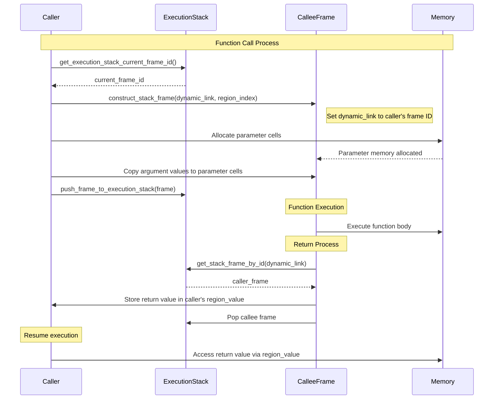

# The Function Call Mechanism in the Argonaut VM

In the Argonaut VM, function calls involve several concepts and structures, including stack frames, parameter passing, return values, and the use of the **Dynamic Link (DL)** for stack traversal.

This document explains the function call mechanism in the Argonaut VM, focusing on how stack frames are constructed, how parameters and return values are handled, and why the `dynamic_link` is used for stack frame traversal during variable resolution.

---

## Function Calls: Constructing Stack Frames

When a function is called, the VM performs the following steps:

1. **Construct the Stack Frame**: A new `stack_frame` is created using the `construct_stack_frame` function.
2. **Set the Dynamic Link**: The `dynamic_link` is set to the ID (index) of the caller's frame on the execution stack.
3. **Set the Region Index**: The `region_index` is set based on the function's lexical scope.
4. **Allocate Parameter Cells**: Memory cells are allocated for the function's parameters, and argument values are assigned.

### Constructing the Stack Frame with Parameters

```c
static stack_frame construct_frame_with_parameters(AST parameter_list, AST argument_list, int region_index) {
    int dynamic_link = get_execution_stack_current_frame_id();
    stack_frame current_frame = construct_stack_frame(dynamic_link, region_index);
    
    // ... (parameter and argument handling)
    
    return current_frame;
}
```

- **`dynamic_link`**: Obtained from `get_execution_stack_current_frame_id()`, which returns the index of the current top frame on the execution stack.
- **`region_index`**: Represents the function's lexical scope, used for variable resolution.

### Parameter Passing

Parameters and arguments are matched and processed:

- **Parameter Cells Allocation**: For each parameter, a cell is allocated in the `current_frame`.
- **Argument Evaluation**: Argument expressions are evaluated, and their values are assigned to the corresponding parameter cells.

The helper function `construct_frame_with_parameters()` ensure that all parameter are correctly copied to the new frame. This involves, allocating memory cells for parameters, and retrieving the values of each cell and assigning them to the corresponding parameter cells.

> ![NOTE]
> The Argonaut does handle complex parameter passing, like passing a struct or array. Each argument cell is allocated to the new frame and the values are also properly copied.

---

## Executing the Function

Once the `stack_frame` is constructed and parameters are initialized, the frame is pushed onto the execution stack:

```c
void execute_func_proc_call(AST ast) {
    // ... (construct frame with parameters)
    push_frame_to_execution_stack(frame);
    execute(region_index);
}
```

- **`push_frame_to_execution_stack`**: Adds the new frame to the execution stack.
- **`execute(region_index)`**: Executes the function body associated with the `region_index`.

---

## Handling Return Values

### Return Value Cell (`region_value`)

The `region_value` in the `stack_frame` is used to store the return value of a function:

- **Functions**: Must set the `region_value` before exiting.
- **Procedures**: Do not use the `region_value`; attempting to return a value results in a *semantic error* during compilation.

### Setting the Return Value

When a `return` statement is executed, the return value is stored in the `region_value` of the **caller**'s frame:

```c
void handle_function_return_value(vm_cell cell) {
    stack_frame current_frame = peek_execution_stack();
    stack_frame *dynamic_link_frame = get_stack_frame_by_id(current_frame.dynamic_link);
    dynamic_link_frame->region_value = cell;
}
```

- **Current Frame**: The callee's frame.
- **Caller Frame**: Retrieved using `current_frame.dynamic_link`.
- **Storing Return Value**: The return value is stored in the `region_value` of the caller's frame.

### Retrieving the Return Value

After the callee frame is popped from the stack, the caller can retrieve the return value:

```c
vm_cell get_return_cell() {
    return get_stack_frame_by_id(peek_execution_stack().dynamic_link)->region_value;
}
```

---

## Handling Function Returns in the Execution Flow

### Function Return Mechanism

When a function reaches a `return` statement:

1. **Return Value Assignment**: The return value is stored in the caller's `region_value`.
2. **Callee Frame Destruction**: The callee's frame is popped from the execution stack.
3. **Execution Resumes in Caller**: The caller retrieves the return value and continues execution.

### Ensuring Correct Execution Flow

In the `resolve_statement_list` function, after executing a function call, we reset the `region_value.is_initialized` flag to prevent premature return:

```c
case A_FUNC_PROC_CALL_STATEMENT: {
    execute_func_proc_call(statement_list);
    peek_execution_stack_as_mutable()->region_value.is_initialized = 0;
    break;
}
```

This ensures that the function's return value doesn't interfere with the execution of subsequent statements in the caller's scope.

---

## Example: Function Call and Return

### Code Example

```argonaut
func add(a : int, b : int) -> int {
    return a + b;
}

proc main() {
    var sum : int;
    sum := add(5, 10);
    print("%d\n", sum); // output 15
}
```

### Execution Steps

1. **Call `add(5, 10)`**:
   - Construct `add`'s frame.
   - `dynamic_link` set to `main`'s frame index.
   - Parameters `a` and `b` are allocated and initialized with `5` and `10`.
2. **Execute `add` Function**:
   - Calculate `a + b` (`5 + 10 = 15`).
   - Call `handle_function_return_value(15)`.
   - Return value (`15`) stored in `main`'s `region_value`.
3. **Pop `add`'s Frame**:
   - `add`'s frame is removed from the execution stack.
4. **Resume Execution in `main`**:
   - Retrieve return value using `get_return_cell()`.
   - Assign `sum := 15`.
   - Print `sum` (`15`).

---

## Summary

- **Stack Frames**: Used for managing function calls and variable scopes.
- **Dynamic Link (`dynamic_link`)**: Points to the caller's frame, used for returning control and for variable resolution traversal.
- **Region Index (`region_index`)**: Represents lexical scope, used to identify the correct frame for variable access.
- **Return Value Cell (`region_value`)**: Holds function return values, ensuring values are passed back to the caller correctly.
- **Function Calls**: Involve constructing a new frame, setting links, allocating parameters, and executing the function body.
- **Variable Resolution**: Achieved by traversing the stack frames using `dynamic_link` and matching `region_index`.

Here is a diagram illustrating the function call mechanism in the Argonaut VM:



Understanding these mechanisms is vital for ensuring correct function behavior, variable access, and execution flow in the Argonaut VM.
